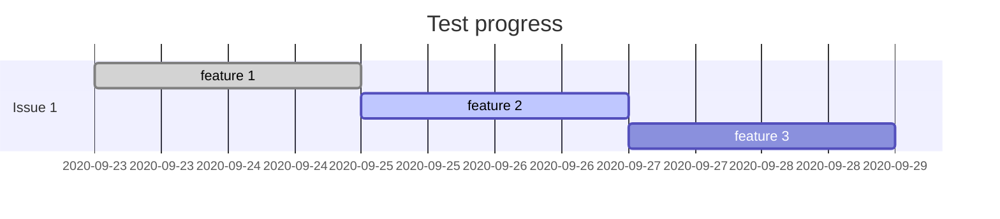

# ANZ joint lab test

## Personal information

| Name   | Student ID    |
| ------ | ------------- |
| 刘嘉佳 | LiuJiaJia2020 |

## Test progress

> *Show your progress below.*

> *Or write it directly:*
***FINISHED:***
...

---
## Answer sheet

> *Write your answer below. (if asked)*

***ISSUE 1:***

Q:对git版本管理原理的理解（不要直接复制粘贴，用自己的话说明）

A:先进的分布式版本管理系统，具有强大的分支管理。每一个参与项目者都有文件的完整版本库，提高安全性，避免了文件意外丢失，提交文件不完整，版本库莫名其妙损坏等情况。通过互联网，可以记录文件的所有改动，并随时可以将文件恢复为某次改动前的版本。通过联网，可以实现多人协作，即同时修改文件并分享交流，最终合并分支，提高效率。

在git中提交一个版本后，git会将此版本完整的保存至git数据库中的一个git仓库。git存储数据时，一个文件版本对应一条内容，类似于一个节点，git数据库其实算一个简单的“键值对”数据库。事实上，你向该数据库中插入任意类型的内容，它都会返回一个键值。通过返回的键值可以在任意时刻再次检索该内容，因此所有版本在git中都有完整记录。通过使用git命令，我们可以实现存储，创建新的分支，并存储至暂存区，利用git的对象数据库，可以跟踪文件的变更情况。最终通过命令，将创建的对象提交为main 并版本间的时许关系与版本注释。

 

***ISSUE 2:***

Q:假如一个团队在github邀请你加入一个项目，现在你准备开始往项目中添加代码，你将如何管理自

己的分支，如何向远程提交你本地的第一份添加的代码呢？

A:找到项目的存储库，单击左上角有个树杈标识的main，搜索要创建的branch的名字，点击create branch：xxxx。单击进入后，点击铅笔标识按键，进行编辑。

添加完代码后，在提交更改的框框内，可以写一些有关更改的说明与描述。

现在已经创建好了这个版本的分支，接下来需pull request拉取请求，给项目管理人审核并交流。

点击上方横栏中的pull requests，在单击绿色的pull requests键，在比较页查看自己的修改与原版本的差别，确定为自己修改的版本后，点击绿色create pull requests键，创建拉取请求，并为拉取请求加上标题与描述。

项目管理人那边，单击单击绿色merge pull requests按钮将更改合并为main，然后再次确认合并，接下来可以删除分支（也可不删除），这样我的代码就正式加到项目中啦✌！

***ISSUE 3:***

Q:在项目开发中，你发现自己提交的代码出现了重大错误，将如何使用“撤回”功能？

A:在pull requests页面 ，找到自己代码合并分支的那一栏，点击紫色的revert恢复键，接下来创建新的拉取请求，确认比较为自己要撤回的版本，编辑拉取请求的标题与说明，create新的拉取请求。然后就等待同伴与你交流，审核你的pull requests吧┑(￣Д ￣)┍。

***ISSUE 4:***

Q:在什么情况下会发生代码冲突？你又可以如何解决呢？

A:冲突分为多种，例如：编辑冲突、内容冲突、逻辑冲突、树冲突等。常见的有编辑冲突、内容冲突。编辑冲突是指：两个开发者对同一个文件的同一行做了修改。内容冲突是指两个开发者对同一个文件的同一块区域做了修改。以下介绍的冲突都默认指编辑冲突。冲突是针对至少三方而言的，例如：1、公共基础文件base；2、甲基于base修改后的新文件；3、乙基于base修改后的新文件。冲突是指：以“不同方式“ 改变“同一文件”的“相同部分”, 三个条件缺一不可。言外之意就是，以“不同方式“ 改变“同一文件”的“不同部分”, 是不会构成冲突的。难点是对“相同部分”的理解，有另一种说法比较好理解：多人对同一个文件的"同一行"做了不同的修改。值得注意的是：这里的"同一行",是指甲乙都修改了“原来的公共基础文件base的同一行”。即：甲乙都针对“原来的公共基础文件base的同一行“进行了修改。冲突是需要根据一个参考坐标系来确定的，这个参考坐标系是“原来的公共基础文件“。

解决：点击open in visual studio code键打开代码，页面显示出冲突部分，进行编写消除冲突，然后再点右上角mark as resolved，点击绿箭commit merge，然后冲突就消除啦，可以合并分支✌。

***鹅一些其他收获吧***

在查看pull request比较两个版本的区别时，可以点击左边的蓝色➕并拖动到你有问题的行数，添加conversation提出你的问题或建议，等待他人解决，得到解决后会保留conversation内容。

git算是版本管理工具，github是基于git的开源项目社区。github是个肥肠肥肠优秀的开源社区，在工作中被广泛使用，也为软件开发人员提供了方便，跨国且拥有海量巨佬的交流平台。。。github具有一定社交属性，开源项目的star数和fork数可以反映出这个开源项目的流行性与热度，如果想看一下别人的项目，可以star一下或把它fork到自己的仓库里。

issue类似于评论区，留言区，讨论区，大家可以在里面交流。它也是个追踪系统，可以用来bug追踪，特性追踪。解决了的issues可以被项目管理团队关闭，自己关闭也行。issues可以反映出项目活跃度高不高。

projects页面是项目管理功能，最简单的，可以创建看板列一些进度清单。projects在企业中挺重要的。里面有不少很强大的功能。

wiki类似于Wiki百科，可以建page，编写项目简介。

insights页面，项目的一些统计信息，比如contributors，浏览次数，clone次数等，多少次提交。

settings有些比较强大的功能，比如githubpages 部署服务可以部署网站，webhooks有消息触发功能，在自动化工具链可以用上

学生时代还是非常有必要学会使用git和github的，一方面方便、便于学习，另一方面省的参加工作时费神了。。。

